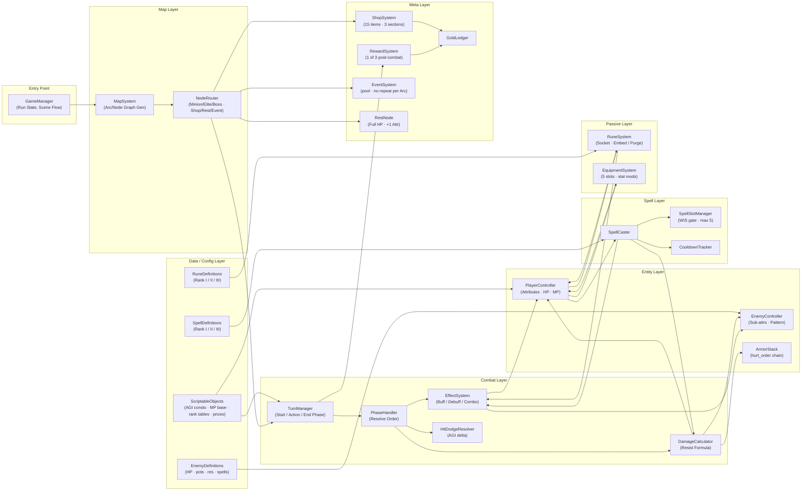

___
**Game:** Wandering Wanderer
**Author:** DukTofn
**Last Updated:** 05/04/2026
**Figma:** [Game Architecture](https://www.figma.com/board/7RvpKSgyjrfYAY65Czb9mo/Wandering-Wanderer---Game-Architecture?node-id=0-1&p=f&t=Sw6bfNqnTEyAvYys-0)
___
## Mục lục
- [Layer Overview](#layer-overview)
- [Implementation Notes](#implementation-notes)

---

---

## Layer Overview

| Layer             | Systems                                                                               | Trách nhiệm                                                            |
| ----------------- | ------------------------------------------------------------------------------------- | ---------------------------------------------------------------------- |
| **Entry Point**   | `GameManager`                                                                         | Run state, điều phối chuyển scene                                      |
| **Map Layer**     | `MapSystem`, `NodeRouter`                                                             | Sinh đồ thị Arc/Node, định tuyến khi vào Node                          |
| **Combat Layer**  | `TurnManager`, `PhaseHandler`, `EffectSystem`, `DamageCalculator`, `HitDodgeResolver` | Vòng lặp lượt, resolve order, buff/debuff/combo, sát thương, hit/dodge |
| **Entity Layer**  | `PlayerController`, `EnemyController`, `ArmorStack`                                   | Trạng thái nhân vật, chuỗi hurt_order                                  |
| **Spell Layer**   | `SpellCaster`, `SpellSlotManager`, `CooldownTracker`                                  | Cast spell, quản lý slot (WIS gate), cooldown                          |
| **Passive Layer** | `EquipmentSystem`, `RuneSystem`                                                       | Inject stat modifier, hook passive vào EffectSystem                    |
| **Meta Layer**    | `ShopSystem`, `RewardSystem`, `EventSystem`, `RestNode`, `GoldLedger`                 | Ngoài combat — shop, reward, event, nghỉ ngơi, kinh tế vàng            |
| **Data / Config** | `ScriptableObjects`, `EnemyDefinitions`, `SpellDefinitions`, `RuneDefinitions`        | Pure data — balancing không cần rebuild                                |

---

## Implementation Notes

1. **EffectSystem** dùng dictionary keyed by `EffectType` để check combo (Enrage + Energized → Overdrive) hiệu quả O(1).
2. **ArmorStack** là sorted list by `hurt_order` — damage lấy `.Last()`, overflow tự lan sang stack kế.
3. **Event combat modifier** (_Force Trade_, _Fading Curse_) là temporary modifier inject vào `PlayerController` với `duration = 1 combat`, không cần persistent modifier system giữa Node.
4. **EnemyController** tách data (HP, potencies, resistances) khỏi behavior pattern (random / cycle / priority) để dễ mở rộng pattern mới.
5. Toàn bộ hằng số balancing (`HIT_THRESHOLD`, `BASE_DODGE`, `BASE_MP_RECOVERY`, bảng giá) nằm trong **ScriptableObjects** — GD chỉnh trực tiếp không cần rebuild.